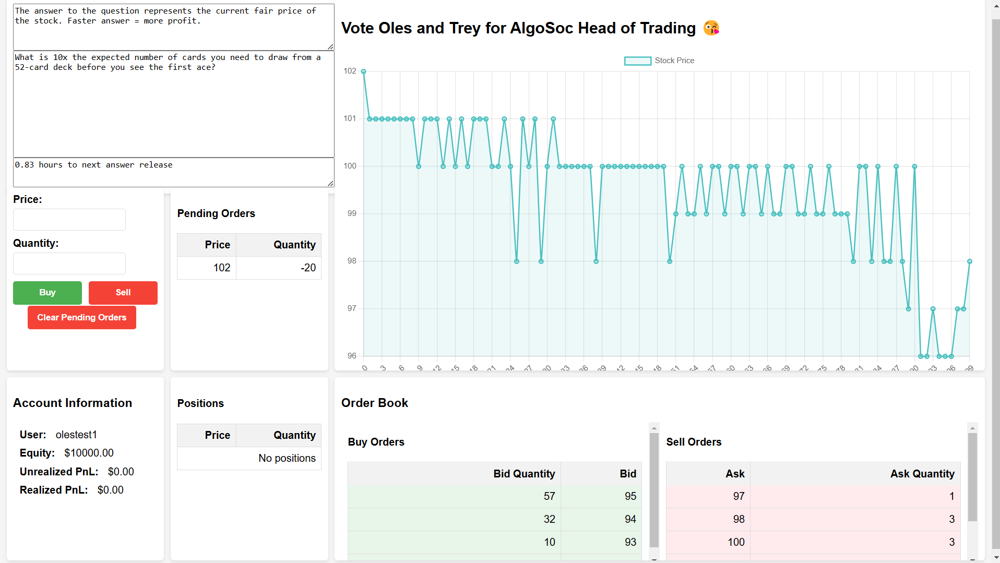

# HoTSocLOB
Description of Project:
- As part of running for co-heads of trading for our university's Algorithmic trading society, we developed a online trading competition over the course of 2 days.
- This is a trading simulation/game where the fair value of the 'stock' being traded is derived from the answer to a probability question that gets updated every 4 hours.
- The technologies used to develop this app include: Python, Django, HTML, CSS, JavaScript, Google cloud, celery, RabbitMQ.
- Features of the interface (displayed below) include: a dashboard to display account information, a buy and sell interface, tables displaying pending orders and current positions, a live chart of the prevailing mid-price, and the live orderbook.

- Other features (backend):
    - Liquidity providing and the updating of the live price chart runs parallel to the website's processes using celery and RabbitMQ to prevent errors when multiple instances of the website are being run.
    - Orderbook matching: Price-time priority matching to match buy and sell orders
    - Liquidity provision (LP): Liquidity providing algorithm that adjusts its quotes based on the prevailing mid-price and microprice. Bid and asks are provided based on two poisson distributions with parameters λ_bid, λ_ask. E.g. 1 on the poisson distribution for the bid-side quotes corresponds to quoting 1 away (below since its the bid side) from the current mid-price. λ (of the poisson distirbution) would increases/decreases linearly to move the quotes provided farther from/nearer to the mid-price based on microprice. When microprice is near the ask, λ_ask increases while λ_bid decreases, and vice versa for when the microprice nears the bid. Based on volatility, a constant (1 or 2) is added to our poisson samples (drawn using numpy) based on the volatility of the mid price, increasing when volatility increases. The bot at all times has a quantity of 100 pending on both the ask and bid, and the ratio of orders on the bid-side and ask-side follows the ratio of the (micro-price - mid-price) and numeric spread (with maximum of 70 and minimum of 30 on any one side). These were all implemented in order to prevent the bot from having an imbalanced ratio of longs to shorts in its positions over the course.
    - Trend setting bot: To prevent the market from shifting completely contrary to the fair value by bad actors, the trend setting bot (within 1 hour of the answer being revealed) provides quotes to shift the market upwards/downwards towards the current fair value (current question's answer).

Notes:
Commands to run (on separate terminals):
python -m celery -A core beat -l info
python -m celery -A core worker -l info -P eventlet 
python manage.py runserver

TODO:
- [x] DB Contains 2 tables --> Users, Orders, PriceHistory
- Order Book Implementation
    - [x] How to store data over the next 5 days? (Solved: Django + Postgresql)
    - [x] Basic price time priority structure/matching
    - [x] Once their unrealized loss > equity, close all positions, set equity to 0 (i.e. can't trade)
    - [x] Display LOB
- QnA
    - [x] Question and Answer csv (31 questions) 
    - [x] UI Display
    - [] UI Timer?
- Interface (Chart + orderbook)
    - Chart implementation (Requires orderbook to be finished first)
        - [x] Backend functions
        - [x] GUI
    - [x] Adding Orders GUI (requires interface)
    - [x] Clear pending orders button
- Username/Account implementation
    - [x] Backend functions
    - [x] Initial page GUI
- Liquidity Provider Implementation
    - [x] Maths functions
    - [x] Make LP run in background with every other user
    - [x] Make LP place limit orders based on distribution (poisson(discrete))
    - Conditions to consider:
        - [x] Orderbook imbalances (lots of asks vs few bids, lots of bids vs few asks)
        - [x] Big spread in the orderbook
        - [x] How to place orders when the market is volatile vs non volatile.
        - [] Avandella Stoikov (Do this if we have extra time)
    - Functions:
        - [x] Market conditions fetch
            - [x] Volatility fetch
        - [x] Inventory/Positions fetch
        - [x] Pending orders fetch
        - [x] Bid quote generator (I.e. Poisson parameter generator, (Poisson RV + 1 or 2))
        - [x] Ask quote generator (I.e. Poisson parameter generator, (Poisson RV + 1 or 2))
        - [x] Unique poisson parameter for both the bids and asks generated
        - [x] Based on volatility, we adjust the constant we add to the poisson RV (to increase/decrease spread) (Keep it the same for both the bid and ask generator)
        - [x] We adjust the poisson parameter based off of orderbook imbalance. E.g. increase the parameter for the bids if there is a likely short
        - [x] Clear quotes
        - [x] Edit quotes as conditions change
- Userstats
    - [x] Backend
    - [x] Unrealized PnL display (would require keeping track of orders)
    - [x] Realized PnL display (current_equity - 1000)
    - [x] Scrollable pending orders display
- [] Make sure GCP runs a unique instance on every device